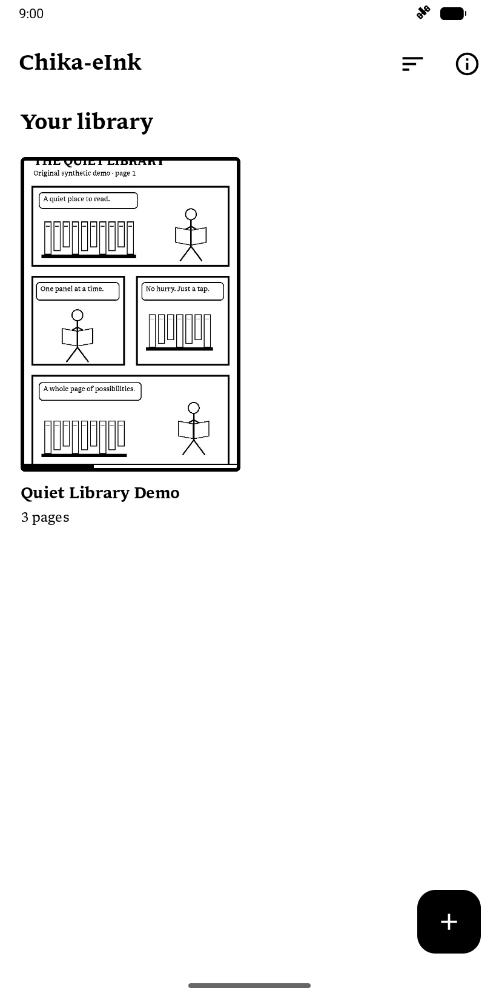
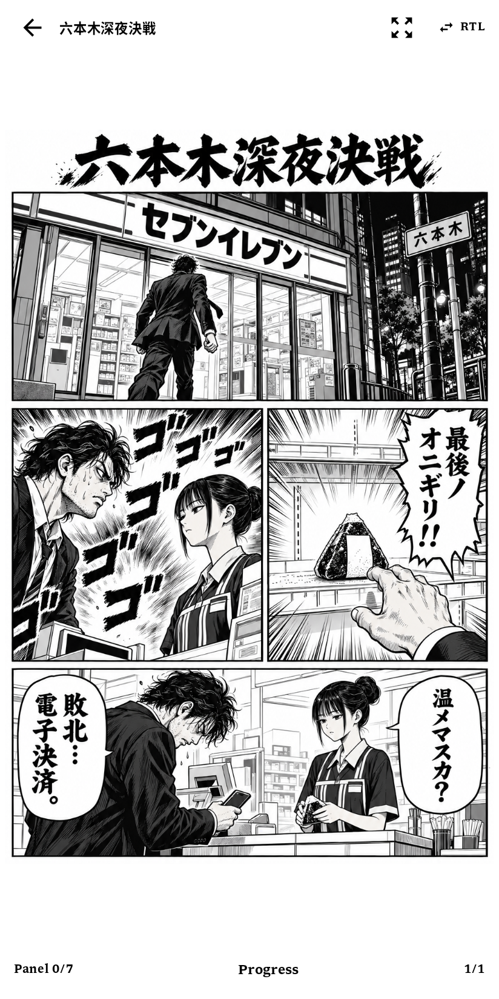
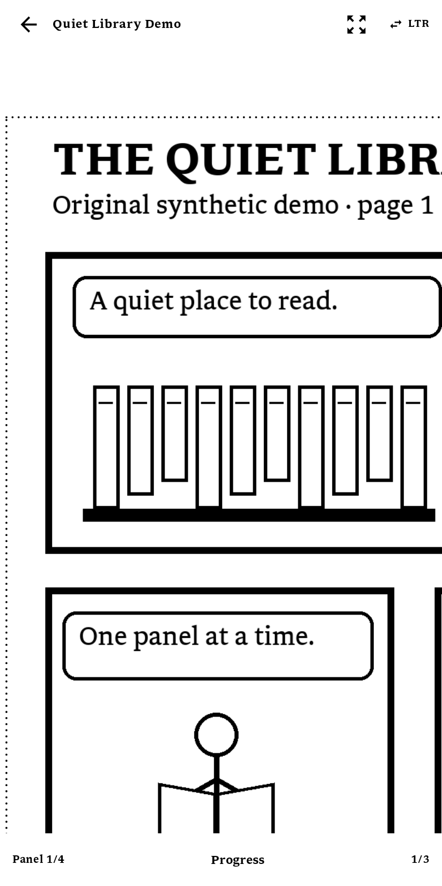
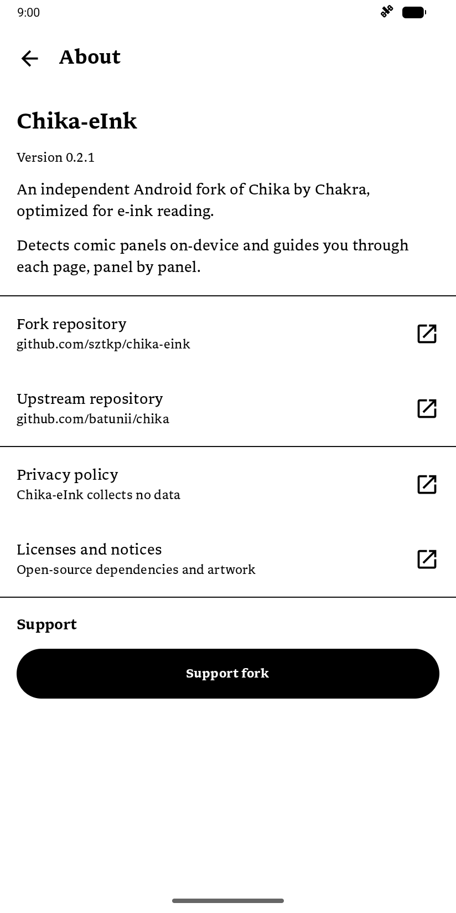

# Chika-eInk

An independent, e-ink-focused Android fork of [Chika](https://github.com/batunii/chika),
the panel-by-panel comic reader by Chakra (Chalchitra Krida). This fork is maintained
at [sztkp/chika-eink](https://github.com/sztkp/chika-eink) and is not an official upstream release.

The initial target is the **BOOX Palma 2**. Changes focus on presentation and interaction:
opaque black-and-white UI, high contrast, static loading indicators, and immediate panel,
page, and navigation transitions. No BOOX-specific APIs or image preprocessing are used.
Physical-device refresh and ghosting testing is still needed; see [the e-ink notes](docs/EINK.md).

[CI](https://github.com/sztkp/chika-eink/actions/workflows/ci.yml) ·
[MPL-2.0](LICENSE) · Android 8.0+

## What it does

Tapping the right side of a page steps you **into each panel** in reading order — page → panel 1 →
panel 2 → … → zoom back out → next page — so a comic reads comfortably on a phone instead of
pinch-zooming around a full page. Panels are detected automatically; you can pan a zoomed panel,
swipe to turn whole pages and flip reading direction (LTR/RTL).

## Features

- **CBZ and CBR** support, including **RAR5** (via 7-Zip-JBinding).
- **On-device ML panel detection** — a small YOLO TFLite model (Manga109-trained) finds panels and
  speech balloons; no network, fully offline.
- **Merge / divide planner** — groups tiny adjacent panels into one comfortable zoom and splits
  oversized panels with a bubble-aware cut.
- **Reader controls** — tap zones to step panels, swipe to turn pages, pinch + drag to pan
  (clamped to the artwork), plain page/panel counts, a "show whole page" button, and an LTR/RTL toggle.
- **Library** — import via the system file picker (copied into app storage), cover thumbnails,
  per-comic resume (page **and** panel), long-press to remove, and saved sorting by title
  A–Z/Z–A, last added, or last read (newest first).
- **E-ink UI** — monochrome controls, clear borders, immediate panel framing, and static status indicators.
- **Libron typography** — bundled v0.25 regular, bold, italic, and bold-italic fonts throughout the UI.

## Screenshots

Captured on an Android emulator with original demo artwork.

| Library | Full-page reader | Panel reading | Menu |
| --- | --- | --- | --- |
|  |  |  |  |

See [artwork provenance](docs/ARTWORK.md) for licensing and reproduction instructions.
These captures do not simulate a physical e-ink display.

## Build & run

Requires **Android Studio** (bundles JDK + SDK). Developed against JDK 21 and Android **API 36**;
`minSdk 26` (Android 8.0). Build tools **36.1.0** are pinned in the project.

```bash
# run the shared core tests
./gradlew :shared:jvmTest
# build a debug APK
./gradlew :app:assembleDebug
# build and install on a connected device/emulator
./gradlew :app:installDebug
```

On Windows without `java` on PATH, point Gradle at Android Studio's bundled JDK first:

```powershell
$env:JAVA_HOME = "C:\Program Files\Android\Android Studio\jbr"
.\gradlew.bat :app:installDebug
```

The debug APK is written to `app/build/outputs/apk/debug/app-debug.apk`.

CI builds the debug APK on every push/PR — see [`.github/workflows/ci.yml`](.github/workflows/ci.yml).

## How panel detection works

1. The page is letterboxed to 640×640 and run through the bundled TFLite model, which returns panel
   and text-balloon boxes.
2. Overlapping/duplicate boxes are suppressed; panels are ordered (rows top→down, LTR/RTL within a
   row).
3. The **planner** merges runs of small adjacent panels (capped for readability) and divides
   oversized panels with a single cut placed between bubble groups.
4. If the model finds nothing on a page, the reader falls back to showing the whole page.

## Architecture

The platform-independent core lives in `:shared`, a Kotlin module targeting JVM only
that `:app` consumes. Its existing `commonMain` / `commonTest` layout is retained.
This fork targets Android only. Core reading, detection, archive handling, and
persistence remain unchanged.

```
:shared (commonMain — pure Kotlin, unit-tested)
  data/archive   ComicArchive interface · image-entry filter · natural page ordering
  detection      Panel model · PanelOrdering (reading order) · PanelPlanner (merge/divide)
  ui/reader      camera math — panel framing (contain fit) + camera lerp

:app (Android)
  data/archive   ZipComicArchive (CBZ), RarComicArchive (CBR/RAR5 via 7-Zip-JBinding)
  data/page      PageLoader — downsampling decode + LRU bitmap cache
  data/db        Room (ComicEntity / dao / db)
  data/library   LibraryRepository — import (copy + cover), list, progress, delete
  detection      MlPanelDetector (TFLite) · whole-page fallback
  ui/reader      ReaderViewModel (page→panel state machine) + ReaderScreen (camera, gestures, chrome)
  ui/library     LibraryViewModel + LibraryScreen
  ui/brand       existing components with simplified fork title, badges, and page indicator
  ui/theme       palette + Libron typography
```

**Stack:** Kotlin · Jetpack Compose (Material 3) · Coroutines · Room · LiteRT ·
Apache Commons Compress · 7-Zip-JBinding.

## License

Chika-eInk's source, including the inherited Chika source, is licensed under the **Mozilla Public License 2.0** — see [`LICENSE`](LICENSE).

Bundled dependencies, fonts, and weights have separate terms; see
[THIRD_PARTY_NOTICES.md](THIRD_PARTY_NOTICES.md) and the [licensing audit](docs/LICENSING.md).
**Distribution review is still open:** the model author corrected its license to AGPL-3.0
in September 2026, and the bundled file matches that model. Native-library source and
replacement obligations also need verification. The source's MPL license does not mean
that every component of the APK is MPL-licensed. This update does not relicense the project.

Libron is OFL-1.1; the original fork book icon is MPL-2.0. The upstream graphical
logo/wordmark and promotional screenshots were removed or replaced; upstream brand rights
and attribution remain respected. See [artwork provenance](docs/ARTWORK.md).
License texts, attribution, and the source URL are included in APKs under `assets/legal/`.

## Acknowledgements

- Original application: [Chika](https://github.com/batunii/chika), by Chakra (Chalchitra Krida).
- **OpenAI Codex** — Chika-eInk is an AI-assisted project, with Codex used to help implement changes, update documentation, and validate builds.
- Panel-detection model: [`leoxs22/manga-panel-detector-yolo26n`](https://huggingface.co/leoxs22/manga-panel-detector-yolo26n) (upstream AGPL-3.0 declaration), trained on Manga109-s.
- UI font: [**Libron**](https://github.com/nicoverbruggen/libron) by Nico Verbruggen, derived from Readerly and Newsreader (SIL Open Font License 1.1).
- **LiteRT**, **Apache Commons Compress**, **7-Zip-JBinding-4Android**, and the AndroidX/Kotlin contributors.
